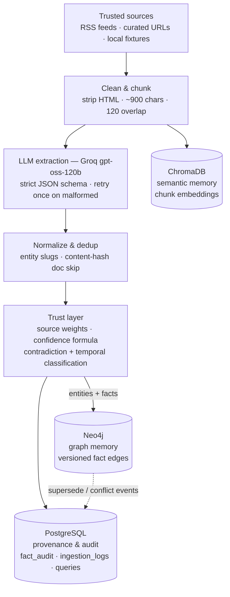
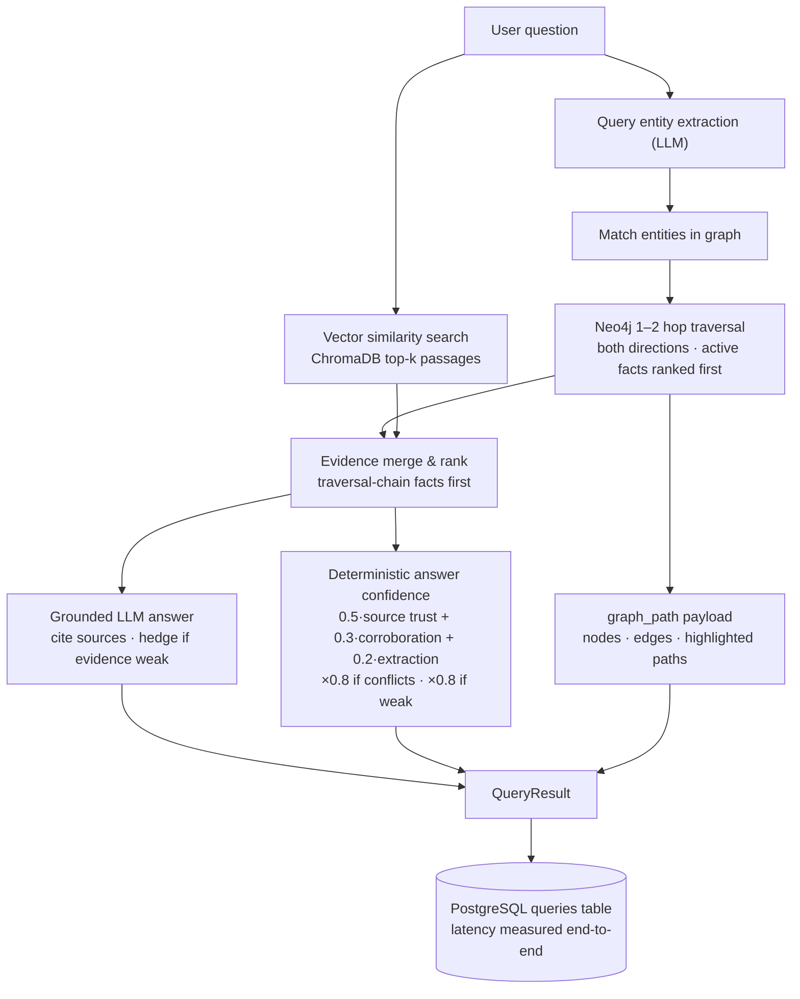
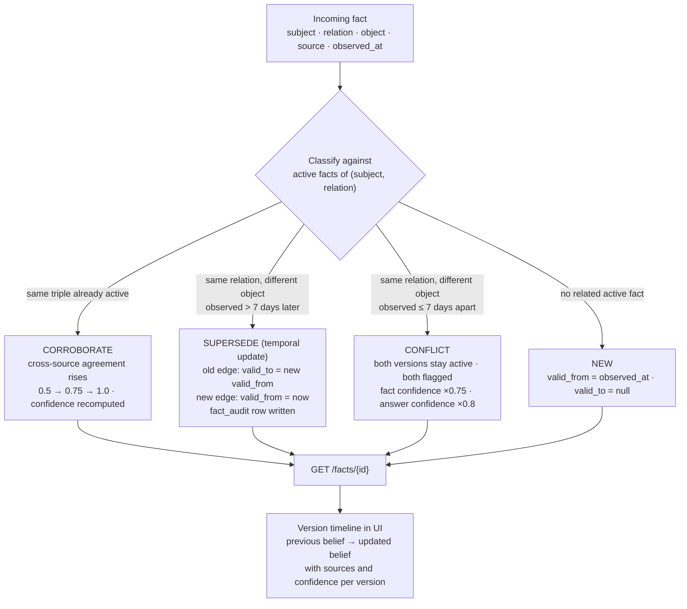

# AI Knowledge Memory Engine

**Traditional RAG retrieves documents. This system builds, maintains, and explains its own memory.**

The engine continuously ingests trusted tech-news sources, extracts structured **facts** (entities +
typed relationships) with an LLM, stores them in a **knowledge graph (Neo4j)** with confidence scores
and temporal validity, keeps raw text as **embeddings (ChromaDB)** for semantic recall, and logs every
change to **PostgreSQL** as provenance/audit records.

The difference from ordinary RAG:

| | Plain RAG | This engine |
|---|---|---|
| Memory shape | flat text chunks | entities + typed relationships |
| Multi-hop questions | cannot connect facts | graph traversal (1–2 hops) |
| Fact changes | old fact overwritten/ignored | **versioned** — old belief stays queryable forever |
| Trust | none | deterministic confidence from source reliability + corroboration |
| Provenance | sometimes a citation | every fact carries source, timestamp, validity window, audit trail |
| Explainability | "here are chunks" | the **actual graph path** used to answer is returned and visualized |

---

## Table of contents

1. [Architecture](#architecture)
2. [Data contracts](#data-contracts)
3. [Confidence (locked formula)](#confidence-locked-formula)
4. [Temporal memory & contradiction handling](#temporal-memory--contradiction-handling)
5. [Retrieval modes](#retrieval-modes)
6. [Ingestion pipeline](#ingestion-pipeline)
7. [API reference](#api-reference)
8. [Frontend](#frontend)
9. [Quickstart](#quickstart)
10. [Repository structure](#repository-structure)
11. [Evaluation](#evaluation)
12. [Testing](#testing)
13. [Configuration](#configuration)
14. [Scope boundaries](#scope-boundaries)

---

## Architecture

### Diagram 1 — Write path: how memory is built

Sources flow through cleaning, chunking, and LLM extraction into three stores. The temporal
decision layer decides whether an incoming fact is new, corroborating, superseding, or conflicting
**before** anything is written — history is never silently overwritten.



### Diagram 2 — Read path: how questions are answered

Three genuinely different retrieval paths. Hybrid merges graph facts and vector passages; the
grounded answer must cite evidence and must express uncertainty when evidence is weak or conflicting.



### Diagram 3 — Temporal memory lifecycle: facts are versioned, never deleted

Every incoming fact is classified against the currently **active** facts of the same
`(subject, relation)` pair. The old belief is always preserved; time is explicit on every edge.



---

## Data contracts

Shared Pydantic models live in `app/extraction/schemas.py` — one single source of truth for every
stage (ingestion, graph, vector, API, UI).

| Model | Purpose |
|---|---|
| `Document` | source article: id, title, url, source, published/retrieved timestamps, text, reliability |
| `Chunk` | embedded piece of a document with source metadata |
| `Entity` | `entity_id`, canonical `name`, `type` (Person / Organization / Product / Money) |
| `Fact` | subject → relation → object edge with `confidence`, `source_id`, `observed_at`, `valid_from`, `valid_to`, `conflict`, `supersedes` |
| `QueryResult` | answer, facts, passages, sources, confidence, `retrieval_mode`, `latency_ms`, plus `graph_path`, `source_cards`, `conflicts` |
| `GraphPath` | compact visualization payload: `nodes[]`, `edges[]`, `paths[]` (ordered node-id chains) |
| `FactHistory` | fact + all its versions + PostgreSQL audit trail |
| `IngestionSummary` | documents seen/added/dup/failed, entities/relationships added, facts superseded/corroborated, conflicts flagged |

## Confidence (locked formula)

Implemented **exactly** in `app/trust/confidence.py` — no learned scoring, deliberately transparent:

```
confidence = 0.50 * source_reliability
           + 0.30 * cross_source_agreement
           + 0.20 * extraction_confidence
```

clamped to `[0, 1]`, where:

- `source_reliability` — per-source weight from `configs/settings.yaml` (e.g. Reuters 0.95, TechCrunch 0.88, unknown 0.6)
- `cross_source_agreement` — **0.5** single source, **0.75** two sources, **1.0** for 3+ corroborating sources
- `extraction_confidence` — the LLM extractor's own stated certainty for the triple

Conflicting facts keep both versions, get flagged, and reduce effective answer confidence (×0.8).
The UI renders this as `Confidence HIGH / MEDIUM / LOW` badges and per-source bars — never a raw decimal.

## Temporal memory & contradiction handling

Decision rules (implemented in `app/trust/contradiction.py` + `app/graph/temporal_update.py`):

| Situation | Action | Guarantee |
|---|---|---|
| Same `(subject, relation, object)` seen again | **CORROBORATE** | agreement ↑, new observation edge, provenance kept |
| Same `(subject, relation)`, different object, observed **later** (> 7 days) | **SUPERSEDE** | old edge gets `valid_to`, new edge inserted, `supersedes` chain links them, audit row written |
| Same `(subject, relation)`, different object, observed **≤ 7 days apart** | **CONFLICT** | both versions stay active, both flagged, confidence penalized |
| Nothing related | **NEW** | plain insert with `valid_from` |

Nothing is ever deleted. `GET /facts/{fact_id}` walks the `supersedes` chain in both directions and
returns every version with its source, timestamps, and confidence — rendered as a timeline in the UI.

## Retrieval modes

Three paths that are **genuinely different** — the mode toggle re-issues a real request, so the
difference is live, not labeled:

| Mode | Evidence used | What it cannot do |
|---|---|---|
| `vector` | Chroma similarity passages only | no graph facts — multi-hop questions get vague answers |
| `graph` | Neo4j traversal facts only | no passages — detail/quote questions get thin evidence |
| `hybrid` | both, chain facts ranked first | — |

The multi-hop demo question — *"Which companies did people who left OpenAI go on to found?"* — needs
two connected edges (`person LEFT/WORKED_AT OpenAI` + `person FOUNDED company`), which vector-only
search cannot compose. The backend returns the traversal as a `graph_path` payload so the UI can
highlight the exact route: `OpenAI ── person ──FOUNDED──> new company`.

## Ingestion pipeline

`POST /ingest` and `scripts/build_memory.py` both run the same straight-line pipeline
(`app/ingestion/pipeline.py`):

1. content-hash dedup (duplicate documents are skipped, batch continues)
2. clean (strip HTML/noise) → chunk (~900 chars, 120 overlap)
3. LLM extraction: entities, then relations, against strict JSON schemas — malformed output is
   retried once, then logged and skipped
4. temporal decision + write to Neo4j (entities, versioned fact edges, confidence)
5. write chunks + metadata to Chroma
6. provenance to PostgreSQL (documents, `fact_audit` for supersede/conflict/corroborate, `ingestion_logs`)

**A single failed document never kills the batch** — it is logged and the pipeline continues.
Rate-limited LLM calls retry with exponential backoff and honor `Retry-After`.

## API reference

Base URL: `http://localhost:8000` (FastAPI serves the UI at `/`).

| Endpoint | Method | Description |
|---|---|---|
| `/query` | POST | `{question, retrieval_mode: vector\|graph\|hybrid}` → full `QueryResult` incl. `graph_path` |
| `/ingest` | POST | `{mode: fixture\|url\|raw, ...}` → `IngestionSummary` |
| `/ingest/fixtures` | GET | list available demo fixtures for live ingestion |
| `/facts/{fact_id}` | GET | fact + version history + audit trail |
| `/eval/results` | GET | latest measured metrics |
| `/eval/run` | POST | run the evaluation suite (retrieval-only for Hit@5/Recall@5 + grounded answers for multi-hop) |
| `/health` | GET | postgres / neo4j / chroma / groq_key / all_ready |
| `/stats` | GET | graph counts: entities, facts, active facts, documents |

Example:

```bash
curl -s localhost:8000/query -H "Content-Type: application/json" \
  -d '{"question": "Which companies did people who left OpenAI go on to found?", "retrieval_mode": "hybrid"}'
```

Response (abridged):

```json
{
  "answer": "People who left OpenAI have gone on to found several AI startups...",
  "facts": [{"subject_name": "Mira Murati", "relation": "FOUNDED", "object_name": "Thinking Machines Lab", "confidence": 0.958, "source_name": "MIT Technology Review", "active": true}],
  "passages": [{"source": "TechCrunch", "text": "...", "similarity": 0.71}],
  "sources": ["MIT Technology Review", "The Verge", "TechCrunch"],
  "confidence": 0.874,
  "confidence_label": "Very high",
  "retrieval_mode": "hybrid",
  "latency_ms": 2487.2,
  "graph_path": {"nodes": [{"id": "ent_openai", "label": "OpenAI", "type": "Organization"}], "edges": [], "paths": [["ent_openai", "ent_mira_murati", "ent_thinking_machines_lab"]]}
}
```

## Frontend

A dark, single-screen product UI (vanilla JS + vendored `vis-network`, served by FastAPI):

- question bar + retrieval-mode toggle (each toggle re-queries for real)
- staged loading messages (entity extraction → graph search → semantic search → merge → answer)
- answer + confidence badge (label + percentage bar, colored by level)
- source cards (name, title, retrieved date, confidence bar)
- fact chips — click any fact to open the **history drawer** (timeline of all versions + audit trail)
- knowledge-graph panel with the actual traversal path highlighted and animated ("edges light up")
- live ingestion button → picks the curated June fixture → toast reports entities/relationships added
  and *"N facts updated (previous version preserved)"*
- evaluation modal showing only measured numbers

## Quickstart

```bash
# 1. infrastructure (Neo4j + PostgreSQL)
docker compose up -d

# 2. dependencies (add --break-system-packages on Ubuntu 24.04)
pip install -r requirements.txt

# 3. set your Groq key in .env
#    GROQ_API_KEY=...          (model: openai/gpt-oss-120b)

# 4. build the memory from the 20-document seed corpus (idempotent, safe to re-run)
python scripts/build_memory.py

# 5. run API + UI
uvicorn app.main:fastapi_app --host 0.0.0.0 --port 8000
# → http://localhost:8000

# 6. evaluation (writes data/eval/results.json)
python scripts/run_evaluation.py
```

Other scripts: `scripts/seed_data.py` (corpus stats / RSS fetch), `scripts/run_query.py "question" --mode hybrid` (CLI).

Health check: `curl localhost:8000/health` → `{"all_ready": true, ...}`.

## Repository structure

```
ai-knowledge-memory-engine/
├── README.md · context.md · handover-team.md · build.md
├── .env.example · requirements.txt · docker-compose.yml
├── configs/settings.yaml            # chunking, retrieval, trust weights, temporal rules
├── data/
│   ├── raw/seed_corpus.json         # 20 curated trusted documents (Mar–May 2025)
│   ├── raw/fixtures/                # live-ingestion demos (June update article)
│   └── eval/questions.json          # 10 eval questions (4 multi-hop)
├── app/
│   ├── main.py                      # FastAPI app, health, stats, eval endpoints, static UI
│   ├── api/                         # routes_query · routes_ingest · routes_facts
│   ├── ingestion/                   # rss_ingester · url_ingester · cleaner · chunker · pipeline
│   ├── extraction/                  # schemas (Pydantic contracts) · entity_extractor · relation_extractor
│   ├── graph/                       # neo4j_client · graph_writer · graph_retriever · temporal_update
│   ├── vector/                      # chroma_client · vector_retriever
│   ├── trust/                       # source_weights · confidence · contradiction
│   ├── rag/                         # hybrid_retriever · prompts · answer_generator
│   ├── db/                          # postgres · models (DDL)
│   ├── evaluation/                  # metrics · evaluate
│   ├── llm.py                       # Groq client (JSON mode, retry/backoff)
│   └── config.py                    # env + settings loader
├── frontend/                        # index.html · app.js · styles.css · vendor/vis-network
├── scripts/                         # seed_data · build_memory · run_query · run_evaluation
├── tests/                           # test_ingestion · test_graph · test_confidence · test_query
└── docs/                            # architecture.md · demo_script.md
```

## Evaluation

`POST /eval/run` (or `python scripts/run_evaluation.py`) measures on the curated question set —
numbers only, nothing hardcoded:

| Metric | Meaning |
|---|---|
| Hit@5 | share of questions with ≥1 expected fact (or passage keyword) in the top-5 evidence |
| Recall@5 | fraction of expected facts retrieved, averaged per question — reported per mode |
| Multi-hop accuracy | share of multi-hop questions whose grounded answer contains all expected entities |
| Avg latency | mean end-to-end query latency across all modes |
| Temporal correctness | PASS/FAIL — after the update fixture, the old fact version must still be retrievable with `valid_to` set |
| Confidence weighting | PASS/FAIL — a low-reliability source must produce visibly lower confidence via the formula |

## Testing

```bash
python -m pytest tests/ -v
```

- **confidence** — exact formula values, clamping, agreement table, conflict penalty
- **ingestion** — cleaning/chunking, duplicate skipping, batch failure isolation, end-to-end doc ingest
- **graph (temporal)** — supersede preserves the old version with `valid_to`, conflict keeps both
  versions flagged, corroborations raise confidence, source/timestamp/confidence returned
- **query** — mode isolation (vector never touches the graph, graph never touches vectors),
  hybrid combines both, latency returned, weak evidence forces uncertainty, API contract via TestClient

## Configuration

All knobs live in `configs/settings.yaml` + `.env`:

```yaml
chunking:      {size: 900, overlap: 120}
retrieval:     {top_k_passages: 5, max_graph_facts: 40, max_hops: 2, max_paths: 6}
temporal:      {supersede_window_days: 7}
llm:           {model: openai/gpt-oss-120b}
trust:
  source_weights: {Reuters: 0.95, TechCrunch: 0.88, ...}
extraction:
  allowed_relations: [FOUNDED, WORKED_AT, LEFT, LEADS, ACQUIRED, INVESTED_IN, RELEASED, RAISED, VALUED_AT]
  entity_types: [Person, Organization, Product, Money]
```

## Scope boundaries

Deliberately **not** built (24-hour bounded prototype decisions, not limitations):
no general web crawler, no auth/multi-tenancy, no custom-trained models, no learned credibility
classifier (the formula is the feature), no community detection, no agent swarms, one LLM provider only.
